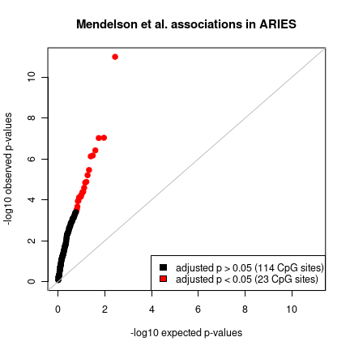

# Using `aries` to access ARIES DNA methylation profiles


This tutorial illustrates the functionality of `aries`
by presenting an EWAS for identifying associations of
BMI with ARIES DNA methylation in ALSPAC parents
in middle age.

## Installation


```r
require(devtools)
devtools::install_github("MRCIEU/aries")
```

## Load the package


```r
library(aries)
```

## ARIES location

The package functions will need to know where ARIES
is located on your system.
In this tutorial, we save this location for later use
in the variable `aries.dir`.


```r
aries.dir <- "path/to/aries"
```

## Select ARIES samples

As noted above, we will analyse the mothers and fathers
of ALSPAC participants in middle age, i.e. at time points
'FOM' and 'FOF', respectively.

> Run `aries.time.points(aries.dir)` to see a list of all
> ARIES time points.

To select this sample subset, we use the `aries.select()`
function.


```r
aries <- aries.select(aries.dir, time.point=c("FOM","FOF"))
```
> Additional arguments for refining sample selection:
> - `featureset` restricts the selection to a specific
>  Illumina bead chips.  If `featureset='epic'`, then only
>  samples with MethylationEPIC Beadchips will be returned.
>
>  Run `aries.featuresets(aries.dir)` to see a list of all
>  feature sets available:
>  450, common, epic.
>  Feature set 'common' allows both EPIC and 450k formats
>  and is the default.

> - `sample.names` restricts the selection to samples with 
>  `SAMPLE_NAME`s found in`sample.names`. If set, `time.point`
>   is ignored.
>
>   A data frame describing all samples can be obtained by running
>  `aries.samples(aries.dir)`. 

The output of `aries.select()` is a list containing ARIES
information for the selected samples. It includes the following
elements:

- `samples` - Data frame providing sample information, one sample per row.
- `probe.names` - Illumina CpG site probe identifiers.
- `control.matrix` - Matrix providing control probe values
 (rows=samples, columns=control probes).
- `cell.counts` - List of cell count estimates for various references.
 Each is a matrix (rows=samples, columns=cell types).

## Load ARIES methylation

Having selected our samples,
we now load the corresponding DNA methylation profiles.


```r
aries$meth <- aries.methylation(aries)
```

`aries.methylation()` returns the matrix of normalized
methylation levels (aka 'betas')
for the specified set of samples.
There is one column for each sample and
one row for each CpG site. 

## Load ALSPAC phenotype/exposure variables *(direct ALSPAC users only)*

Direct users of ALSPAC can load ALSPAC
data into R using the `alspac` R package
(https://github.com/explodecomputer/alspac).

It can be installed from github:

```r
require(devtools)
devtools::install_github("explodecomputer/alspac")
```

We load the package and tell it where
the ALSPAC dataset is located
(On University of Bristol Windows computers,
this is typically `R://Data`).

```r
library(alspac)
alspac::setDataDir("path/to/alspac/data")
```

Next we load the BMI variables for the ALSPAC
participant mothers and fathers measured at middle age
(see https://github.com/explodecomputer/alspac for
more information on how to use the `alspac` package).

```r
varnames <- c("fm1ms111", ## mother BMI 
              "ff1ms111") ## father BMI
variable.index <- alspac::findVars(varnames)
stopifnot(all(varnames %in% tolower(variable.index$name)))
alspac <- alspac::extractVars(variable.index)
```

We give the variables more meaningful names
and set any negative BMI values to missing.

```r
alspac$bmi.mother <- alspac$fm1ms111
alspac$bmi.mother[which(alspac$bmi.mother < 0)] <- NA

alspac$bmi.father <- alspac$ff1ms111
alspac$bmi.father[which(alspac$bmi.father < 0)] <- NA
```

## Prepare data for EWAS

We reorder the samples in the ALSPAC dataset
to match the DNA methylation data.

```r
alspac <- alspac[match(aries$samples$aln, alspac$aln),]
```
(If we were analysing data from the ALSPAC child participants,
then we should use `alnqlet` rather than `aln`.)

Next we construct a data frame
containing our variable of interest (BMI)
and all covariates (sex, plate, and cell counts).

```r
ewas.data <- data.frame(bmi=NA,
                        sex=aries$samples$sex,
                        batch=aries$samples$plate,
                        aries$cell.counts[["blood-gse35069"]])
```

BMI was left missing because
we need to combine two BMI variables, one
for mothers and the other for fathers,
into a single variable.
Here we first fill in BMI for mothers and then BMI for fathers.

```r
mothers.idx <- which(aries$samples$time_point == "FOM")
ewas.data$bmi[mothers.idx] <- alspac$bmi.mother[mothers.idx]
fathers.idx <- which(aries$samples$time_point == "FOF")
ewas.data$bmi[fathers.idx] <- alspac$bmi.father[fathers.idx]
```

## Run EWAS

Here we use the R Bioconductor package
[limma](https://www.bioconductor.org/packages/release/bioc/html/limma.html)
to test associations.


```r
library(limma)
design <- model.matrix(~., ewas.data)
fit <- lmFit(aries$meth[,rownames(design)], design) 
fit <- eBayes(fit)
```

## Compare associations to a published study

We compare our associations to a large published EWAS of BMI (n=3743).

> Mendelson MM, Marioni RE, Joehanes R, et al. Association of Body Mass
> Index with DNA Methylation and Gene Expression in Blood Cells and
> Relations to Cardiometabolic Disease: A Mendelian Randomization
> Approach. PLoS Med. 2017;14(1):e1002215.

We load summary statistics from the study.


```r
read.mendelson <- function(filename) {
    require(readxl)
    ret <- read_xlsx(filename, skip=2)
    ret <- as.data.frame(ret)
    cols <- colnames(ret)
    names(cols) <- cols
    cols[c("Probename","β...9","p-value...11")] <- c("cpg","effect","p.value")
    colnames(ret) <- cols
    ret
}
bmi <- read.mendelson("bmi-mendelson-plosmed-2017.xlsx")
rownames(bmi) <- bmi$cpg
```

Mendelson et al. identify 137 CpG sites associated with BMI.

```r
sites <- rownames(fit$coefficient)
common <- intersect(bmi$cpg, sites)
```
Of these, 135 CpG sites are measured in ARIES. 

Effect sizes for these sites are highly correlated with ARIES:

```r
cor(bmi[common,"effect"],
    fit$coefficient[common,"bmi"])
```

```
## [1] 0.8284101
```

There is a large overlap
between the top 135 CpG site associations
observed in each study.

```r
top <- rownames(fit$p.value)[order(fit$p.value[,"bmi"])[1:length(common)]]
tab <- table(mendelson=sites %in% common,
             aries=sites %in% top)
kable(tab)
```


|      |  FALSE| TRUE|
|:-----|------:|----:|
|FALSE | 482816|  117|
|TRUE  |    117|   18|
(Fisher's exact test p = 3.404676 &times; 10<sup>-43</sup>)

Nearly all associations that survive adjustment for multiple
tests in ARIES also survive adjustment for multiple tests
in Mendelson et al. 

```r
padj <- p.adjust(fit$p.value[,"bmi"])
sig <- rownames(fit$p.value)[padj < 0.05]
tab <- table(mendelson=sites %in% common,
             aries=sites %in% sig)
kable(tab)
```


|      |  FALSE| TRUE|
|:-----|------:|----:|
|FALSE | 482932|    1|
|TRUE  |    132|    3|
(Fisher's exact test p = 8.5356987 &times; 10<sup>-11</sup>).

Overall, the Mendelson et al. associations are replicated in ARIES
as illustrated by the following QQ-plot showing p-values in ARIES for 
the top Mendelson et al. CpG site associations.


```r
bmi$p.aries <- fit$p.value[match(bmi$cpg, rownames(fit$p.value)),"bmi"]
bmi$col <- "black"
bmi$col[which(p.adjust(bmi$p.aries,"bonferroni") < 0.05)] <- "red"
bmi <- bmi[order(bmi$p.aries),]
bmi$p.exp <- ppoints(bmi$p.aries)
lim <- rev(range(c(bmi$p.aries, bmi$p.exp), na.rm=T))
plot(x=-log10(bmi$p.exp), y=-log10(bmi$p.aries),
     xlim=-log10(lim), ylim=-log10(lim),
     pch=19,
     main="Mendelson et al. associations in ARIES",
     xlab="-log10 expected p-values",
     ylab="-log10 observed p-values",
     col=bmi$col)
abline(0,1,col="gray")
legend("bottomright",
       legend=c(
           paste0("adjusted p > 0.05 (",
                  sum(bmi$col=="black",na.rm=T), " CpG sites)"),
           paste0("adjusted p < 0.05 (",
                  sum(bmi$col=="red",na.rm=T), " CpG sites)")),
       fill=c("black","red"))           
```



