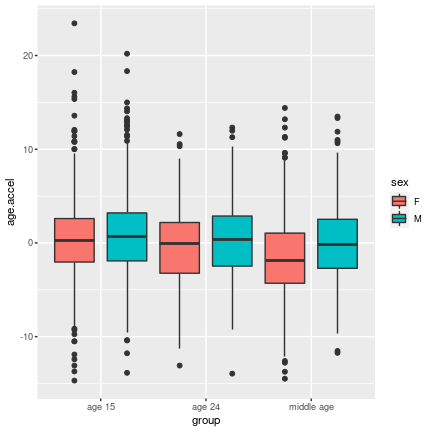

# Test `aries`

We start by loading the package
and saving the directory containing the ARIES data.
```r
library(aries)
aries.dir <- "path/to/aries/"
```

We will load ALSPAC data later as part of the test. 
For this we will use the `alspac` R package.
```r
library(alspac)
alspac.dir <- "path/to/alspac"
alspac::setDataDir(alspac.dir)
```

## Test `aries.feature.sets()`


```r
stopifnot(identical(aries.feature.sets(aries.dir), c("450","common","epic")))
```

## Test `aries.time.points()`


```r
stopifnot(identical(aries.feature.sets(aries.dir), c("450","common","epic")))
```

## Test `aries.select()`

We test `aries.select()` verifying that manually merging
subsets of samples gives the same result and requesting
all samples at the same time.

Constuct datasets with all age 15-17 year-old profiles,
just Illumina 450k profiles,
and just Illumina EPIC profiles
using `aries.select()`.


```r
ds.15up <- aries.select(aries.dir, featureset="common", time.point="15up")
ds.15up.450 <- aries.select(aries.dir, featureset="450", time.point="15up")
ds.15up.epic <- aries.select(aries.dir, featureset="epic", time.point="15up")
```

From the 450k and EPIC-only datasets,
construct a combined dataset manually.

```r
controls <- intersect(colnames(ds.15up$control.matrix), colnames(ds.15up.epic$control.matrix))
ds.check <- list(cell.counts=sapply(names(ds.15up$cell.counts), function(ref)
                     rbind(ds.15up.epic$cell.counts[[ref]], ds.15up.450$cell.counts[[ref]]), simplify=F),
                 control.matrix=rbind(ds.15up.epic$control.matrix[,controls],
                                      ds.15up.450$control.matrix[,controls]),
                 samples=rbind(ds.15up.epic$samples, ds.15up.450$samples))
```

For the comparison, we will need a function to determine
if two matrices are identical apart from different
row orderings. 

```r
identical.rows <- function(x,y) {
    common <- intersect(rownames(x), rownames(y))
    length(common) == nrow(x) && identical(x[common,], y[common,])
}
```

Check `aries.select()$cell.counts`:

```r
for (ref in names(ds.15up$cell.counts))
    stopifnot(identical.rows(ds.15up$cell.counts[[ref]], ds.check$cell.counts[[ref]]))
```

Check `aries.select()$samples`:

```r
stopifnot(identical.rows(ds.15up$samples, ds.check$samples))
```

Checking `aries.select()$control.matrix` is slightly more
complicated because the controls in the 450k and EPIC bead chips
are somewhat different. Instead of checking for a perfect match,
we verify that the control probe intensities are most correlated
for matching samples than for mismatching samples.

```r
stopifnot(identical.rows(ds.15up$samples, ds.check$samples))
```

## Test `aries.methylation()`

We test `aries.methylation()` by testing associations of DNA methylation with:

- gestational age
- birthweight
- BMI
- alcohol intake
- smoking
- prenatal tobacco exposure
- age
- sex

### Preparing data for analyses

We load these exposure and phenotype variables from ALSPAC
as a data frame `alspac` ...

```r
source("load-alspac.r")
```

... EWAS summary statistics ...

```r
source("load-ewas.r")
```

... DNAm alcohol models ...

```r
## devtools::install_github("yousefi138/dnamalci")
library(dnamalci)
```

... DNAm age models ...

```r
## devtools::install_github("perishky/meffonym")
library(meffonym)
```

... add DNAm models for prenatal tobacco exposure,
BMI, smoking, and sex ...

```r
reese <- read.csv("ewas/pte-reese-ehp-2017.csv")
meffonym.add.model("pte-reese-ehp-2017",
                   reese$cpg, reese$effect,
                   "reese-ehp-2017 model for prenatal smoking")

meffonym.add.model("bmi-mendelson-plosmed-2017",
                   ewas[["bmi-mendelson-plosmed-2017"]]$cpg,
                   ewas[["bmi-mendelson-plosmed-2017"]]$effect,
                   "mendelson-plosmed-2017 model for bmi")

meffonym.add.model("smoking-joehanes-ccg-2016",
                   ewas[["smoking-joehanes-ccg-2016"]]$cpg,
                   ewas[["smoking-joehanes-ccg-2016"]]$effect,
                   "joehanes-ccg-2016 model for own smoking")

meffonym.add.model("sex-aries-15-unadj",
                   ewas[["sex-aries-15-unadj"]]$cpg,
                   ewas[["sex-aries-15-unadj"]]$effect,
                   "ARIES stats for PACE sex differences study")
```

... collect CpG sites from EWAS summary statistics and DNAm models ...

```r
alcohol.sites <- names(dnamalci.get.model("dnamalc.144cpg")$coefficients)

model.sites <- sapply(meffonym.models(), function(model)
                      names(meffonym.get.model(model)$coefficients),
                      simplify=F)

ewas.sites <- lapply(ewas, function(ewas) ewas$cpg)

sites <- unique(c(unlist(ewas.sites),
                  unlist(model.sites),
                  unlist(alcohol.sites)))
```

... load ARIES DNAm profiles ...

```r
time.points <- aries.time.points(aries.dir)
aries <- sapply(time.points, function(time.point) {
    ds <- aries.select(aries.dir,
                       time.point=time.point)
    ds$meth <- aries.methylation(ds)
    ds$meth <- ds$meth[which(rownames(ds$meth) %in% sites),]
    ds
}, simplify=F) ## 2 minutes

## order aries time-point subsets by age for convenient outputs
for (i in 1:length(aries))
    aries[[i]]$median.age <- round(median(aries[[i]]$samples$age, na.rm=T),1)
aries$cord$median.age <- 0
aries <- aries[order(sapply(aries, function(ds) ds$median.age))]
```

... add ALSPAC exposure and phenotype variables to ARIES ...

```r
time.points.children <- c("cord","c43m","c61m","F7","F9","15up","F24")

for (tp in time.points.children) {
    idx <- match(aries[[tp]]$samples$alnqlet, alspac$alnqlet)
    aries[[tp]]$samples$gestationalage <- alspac$gestational.age[idx]
    aries[[tp]]$samples$birthweight <- alspac$birthweight[idx]
    aries[[tp]]$samples$pte <- alspac$smoking.prenatal[idx]
    aries[[tp]]$samples$prenatal.alcohol <- alspac$prenatal.alcohol[idx]
}

idx <- match(aries[["F7"]]$samples$alnqlet, alspac$alnqlet)
aries[["F7"]]$samples$bmi <- alspac$bmi.child.7[idx]

idx <- match(aries[["F9"]]$samples$alnqlet, alspac$alnqlet)
aries[["F9"]]$samples$bmi <- alspac$bmi.child.7[idx]

idx <- match(aries[["15up"]]$samples$alnqlet, alspac$alnqlet)
aries[["15up"]]$samples$smoking <- alspac$smoking.child.17[idx]
aries[["15up"]]$samples$cotinine <- alspac$cotinine.child.17[idx]
aries[["15up"]]$samples$bmi <- alspac$bmi.child.17[idx]

idx <- match(aries[["F24"]]$samples$alnqlet, alspac$alnqlet)
aries[["F24"]]$samples$smoking <- alspac$smoking.child.24[idx]
aries[["F24"]]$samples$cotinine <- alspac$cotinine.child.17[idx]
aries[["F24"]]$samples$bmi <- alspac$bmi.child.24[idx]

idx <- match(aries[["antenatal"]]$samples$aln, alspac$aln)
aries[["antenatal"]]$samples$smoking <- alspac$smoking.prenatal[idx]
aries[["antenatal"]]$samples$alcohol <- alspac$prenatal.alcohol[idx]
aries[["antenatal"]]$samples$cotinine <- alspac$cotinine.prenatal[idx]
aries[["antenatal"]]$samples$bmi <- alspac$bmi.pre[idx]

idx <- match(aries[["FOM"]]$samples$aln, alspac$aln)
aries[["FOM"]]$samples$smoking <- alspac$smoking.middle[idx] == "current"
aries[["FOM"]]$samples$alcohol <- alspac$alcohol.middle[idx]
aries[["FOM"]]$samples$audit <- alspac$alcohol.audit[idx]
aries[["FOM"]]$samples$bmi <- alspac$bmi.middle[idx]

idx <- match(aries[["FOF"]]$samples$aln, alspac$aln)
aries[["FOF"]]$samples$smoking <- alspac$smoking.father[idx] == "current"
aries[["FOF"]]$samples$alcohol <- alspac$alcohol.father[idx]
aries[["FOF"]]$samples$bmi <- alspac$bmi.father[idx]
```

... and finally define functions for testing CpG site associations.

```r
test.assoc <- function(aries, var, cpg, ...) {
    covs <- list(...)
    covs <- lapply(covs, as.data.frame)
    data <- data.frame(var=var, do.call(cbind, covs))
    meth <- aries$meth[cpg,]
    fit <- lm(meth ~ ., data=data)
    stats <- coef(summary(fit))
    colnames(stats) <- c("effect","se","t.stat","p.value")
    stats[grep("^var",rownames(stats))[1],]
}
test.assocs <- function(aries, var, cpgs, ...) {
    stats <- t(sapply(cpgs, function(cpg) test.assoc(aries, var, cpg, ...)))
    as.data.frame(stats)
}
```

### Correlation with published EWAS effects

We fit models to test associations with DNAm
and calculate correlations between the effects we observe
here and effects reported in the literature.

```r
r.effects <- sapply(names(aries), function(time.point) {
    ds <- aries[[time.point]]
    sapply(names(ewas), function(ewasname) {
        varname <- sub("([^-]+).*", "\\1", ewasname)
        if (!varname %in% colnames(ds$samples)
            || length(unique(ds$samples[[varname]])) < 2)
            return(NA)        
        old.stats <- ewas[[ewasname]]
        old.stats <- old.stats[old.stats$cpg %in% rownames(ds$meth),]
        counts <- ds$cell.counts[["blood-gse35069-complete"]]
        new.stats <- test.assocs(ds,
                                 ds$samples[[varname]],
                                 old.stats$cpg,
                                 batch=ds$samples$plate,
                                 counts=counts)
        cor(old.stats$effect, new.stats$effect, use="p")
    })
})
```


```r
kable(r.effects, digits=2)
```


|                                | cord| c43m|  c61m|   F7|   F9|  15up|  F24| antenatal|  FOM|  FOF|
|:-------------------------------|----:|----:|-----:|----:|----:|-----:|----:|---------:|----:|----:|
|sex-aries-0-unadj               | 1.00| 0.98|  0.97| 1.00| 0.99|  0.98| 0.97|          |     |     |
|sex-aries-7-unadj               | 0.99| 0.98|  0.97| 1.00| 0.99|  0.98| 0.95|          |     |     |
|sex-aries-15-unadj              | 0.99| 0.98|  0.97| 1.00| 0.99|  0.99| 0.97|          |     |     |
|smoking-joehanes-ccg-2016       |     |     |      |     |     |  0.67| 0.85|      0.98| 0.98| 0.96|
|pte-joubert-ehp-2012-aries      | 0.87| 0.60| -0.09| 0.58| 0.47|  0.57| 0.58|          |     |     |
|birthweight-simpkin-hmg-2015    | 0.92| 0.19| -0.14| 0.51| 0.69| -0.19| 0.32|          |     |     |
|gestationalage-simpkin-hmg-2015 | 0.87| 0.07|  0.12| 0.38| 0.29|  0.02| 0.00|          |     |     |
|bmi-mendelson-plosmed-2017      |     |     |      | 0.31| 0.27|  0.77| 0.67|      0.60| 0.81| 0.73|

As expected, correlation of:
- sex effects is nearly perfect.
- smoking effects roughly increases with time spent smoking to nearly perfect in middle age.
- prenatal smoking effects is high at birth and then decreases. Interestingly, the correlations settle around R=0.6 from age 3.5 (43 months) onward and is consistent with effects observed many years after birth (PMID29860346).
- birthweight is high at birth and then very inconsistent afterward (PMID25869828).  The >0.5 correlations at ages 7 and 9 appear to be real. The lack of correlation between birth and age 7 is likely due to extremely small sample sizes at those time points.
- gestational age is high at birth and then mostly disappears (PMID25869828).
- BMI is high in adults (it was derived in adults) and lower in children.

### Correlations with published DNAm models of continuous phenotypes/exposures


```r
r.models <- sapply(names(aries), function(time.point) {
    ds <- aries[[time.point]]
    scores <- list(age=meffonym.score(ds$meth, "age.hannum")$score,
                   bmi=meffonym.score(ds$meth, "bmi-mendelson-plosmed-2017")$score,
                   gestationalage=meffonym.score(ds$meth, "ga.bohlin.1se")$score,                   
                   cotinine=meffonym.score(ds$meth, "smoking-joehanes-ccg-2016")$score,
                   alcohol=dnamalci(ds$meth, "dnamalc.144cpg")$score)
    scores$audit <- scores$alcohol
    sapply(names(scores), function(varname) {
        if (varname %in% colnames(ds$samples))
            cor(scores[[varname]], ds$samples[[varname]], use="p")
        else
            NA
    })
})
```


```r
kable(r.models, digits=2)
```


|               | cord|  c43m| c61m|   F7|   F9|  15up|  F24| antenatal|  FOM|  FOF|
|:--------------|----:|-----:|----:|----:|----:|-----:|----:|---------:|----:|----:|
|age            |     |  0.11| 0.18| 0.05| 0.10|  0.13| 0.21|      0.67| 0.61| 0.72|
|bmi            |     |      |     | 0.07| 0.10|  0.16| 0.24|      0.16| 0.30| 0.32|
|gestationalage | 0.68| -0.10| 0.47| 0.04| 0.01| -0.01| 0.02|          |     |     |
|cotinine       |     |      |     |     |     |  0.46| 0.46|      0.52|     |     |
|alcohol        |     |      |     |     |     |      |     |          | 0.25| 0.18|
|audit          |     |      |     |     |     |      |     |          | 0.37|     |

As expected, correlation of model scores with:
- age increases with age (models were developed in adults) and is highest where there is greatest age variation.
- BMI increases with age (models were developed in adults) with correlations similar to those published (PMID32228717).
- gestational age was high at expected levels at birth (PMID28932320) and then essentially null elsewhere.
- cotinine were quite high (R>0.45), however lower than published in another study (R=0.65, PMID24120260).
- alcohol were similar to those previously published (PMID31775873).
- audit score were similar to those previously published (PMID31775873).

### AUC for published DNAm models of binary exposures


```r
library(pROC)

r.auc <- sapply(names(aries), function(time.point) {
    ds <- aries[[time.point]]
    scores <- list(pte=meffonym.score(ds$meth, "pte-reese-ehp-2017")$score,
                   sex=meffonym.score(ds$meth, "sex-aries-15-unadj")$score,
                   smoking=meffonym.score(ds$meth, "smoking-joehanes-ccg-2016")$score)
    sapply(names(scores), function(varname) {
        if (varname %in% colnames(ds$samples) && length(na.omit(unique(ds$samples[[varname]]))) > 1)
            auc(ds$samples[[varname]], scores[[varname]])
        else
            NA
    })
})
```


```r
kable(r.auc, digits=2)
```


|        | cord| c43m| c61m|   F7|   F9| 15up|  F24| antenatal|  FOM|  FOF|
|:-------|----:|----:|----:|----:|----:|----:|----:|---------:|----:|----:|
|pte     | 0.89| 0.87| 0.62| 0.85| 0.78| 0.82| 0.84|          |     |     |
|sex     | 1.00| 1.00| 0.94| 1.00| 0.99| 1.00| 1.00|          |     |     |
|smoking |     |     |     |     |     | 0.56| 0.70|      0.97| 0.92| 0.87|

As expected, AUC for DNAm models of:
- prenatal tobacco exposure was high (above 0.8) as published (PMID27323799).
- sex were nearly perfect.
- smoking was high for long-term smokers (above or near 0.9) and somewhat lower for newer smokers. 

### Evaluations of DNAm age acceleration (Hannum)


```r
aries$all <- aries.select(aries.dir)
aries$all$meth <- aries.methylation(aries$all) ## 2 minutes
aries$all$meth <- aries$all$meth[which(rownames(aries$all$meth) %in% sites),]

cord.idx <- which(aries$all$samples$time_point == "cord")
alspac.idx <- match(aries$all$samples$alnqlet[cord.idx], alspac$alnqlet)
aries$all$samples$age[cord.idx] <- (alspac$gestational.age[alspac.idx]-40)/52

aries$all$samples$age.hannum <- meffonym.score(aries$all$meth, "age.hannum")$score
idx <- which(!is.na(aries$all$samples$age))
aries$all$samples$age.accel <- NA
aries$all$samples$age.accel[idx] <- residuals(lm(age.hannum ~ .,
                                          data=cbind(
                                              aries$all$samples[idx,c("age.hannum","age","plate")],
                                              aries$all$cell.counts[["blood-gse35069-complete"]][idx,])))
```

Correlation of DNAm age estimates is quite high as expected
across all of ARIES (R = 0.940349).


Consistent with the literature (PMID27511193),
adult males tend to have higher age acceleration than females.


```r
group <- with(aries$all$samples, {
    group <- rep(NA, length(time_point))
    group[which(time_point == "15up")] <- "age 15"
    group[which(time_point == "F24")] <- "age 24"
    group[which(time_point %in% c("FOM","FOF"))] <- "middle age"
    group
})

dnam.aa.by.sex <- t(sapply(c("age 15","age 24","middle age"), function(gp) {
    idx <- which(group == gp)
    with(aries$all$samples[idx,], {
        if (length(unique(na.omit(sex))) < 2) return(rep(NA,4))
        fit <- lm(age.accel ~ sex)
        stats <- coef(summary(fit))[2,]
        names(stats) <- c("difference","se","t-statistic","p.value")                
        stats
    })
}))
```


```r
kable(dnam.aa.by.sex,digits=2)
```


|           | difference|   se| t-statistic| p.value|
|:----------|----------:|----:|-----------:|-------:|
|age 15     |       0.36| 0.15|        2.46|    0.01|
|age 24     |       0.82| 0.35|        2.32|    0.02|
|middle age |       1.62| 0.24|        6.87|    0.00|
(The 'middle age' group combines ALSPAC mothers and fathers
at middle age, i.e. time points 'FOM' and 'FOF'). 




